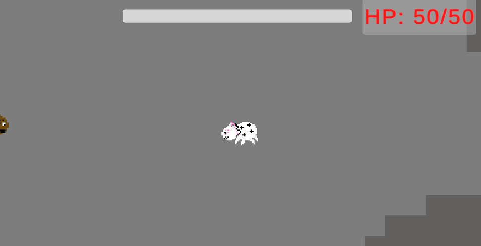
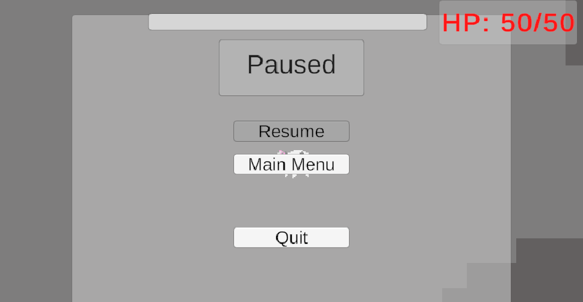
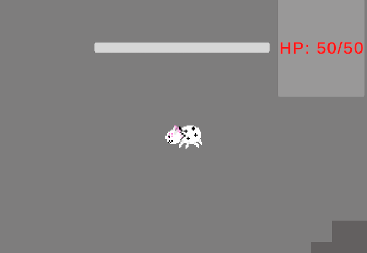
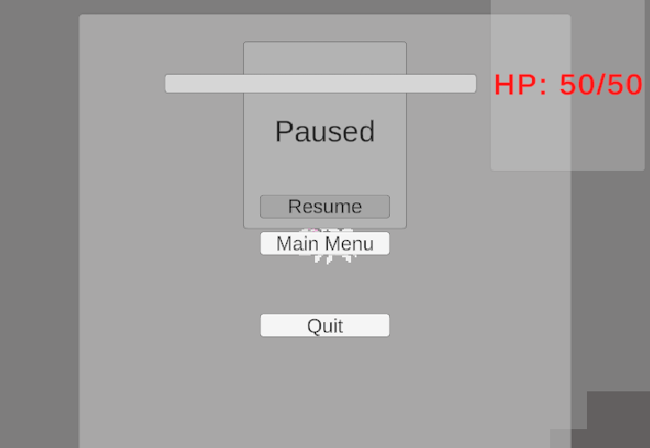

## current interfaces
| UI Component | Parent Object | Anchor Position | Pivot | Purpose | interactable |
| -- | -- | -- | -- | -- | -- |
| Player HP bar / text | Canvas UI | Top Middle of the screen |  | Display the players HP | No |
|Abilite wheel|Canvas UI|Center of the screen||Show the players the options for abilite upgrade|no|
|Abilite wheel Options|Abilite wheel UI|Center of the Abilite wheel UI||Allow the player to chose a abilite to upgrade|yes|
|pause menu|Canvas UI|Center of screen||display the pause menu options|No|
|Pause menu Resuem|Pause Menu Canvas UI|Center of Pause Menu||let the player resume play|Yes|
|Pause menu Exit|Pause Menu Canvas UI|Center of Pause Menu||Let player exit the game|Yes|
|main menu|Canvas UI|Center of screen||Display the options for the main menu|No|
|main menu play|Main Menu Canvas UI|Center of Main Menu||Let the player start the game|Yes|
|main menu Exit|Main Menu Canvas UI|Center of Main Menu||Let the player close the game|Yes|

## issues with swaping aspect ratio
| issue | where |
| -- | -- | 
| HP box Streches down| top left|
| HP Bar to low | Top middel |
| Pause Title Streching | Top of Pause menu |
|HP UI Covers pause ui | Top left |

